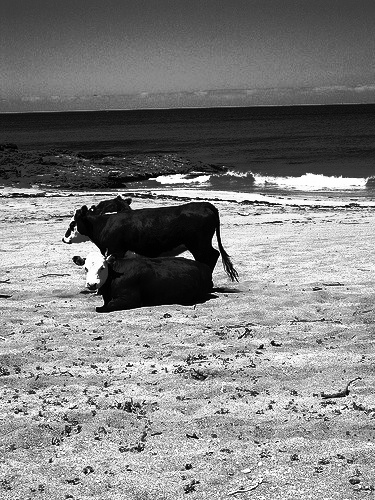
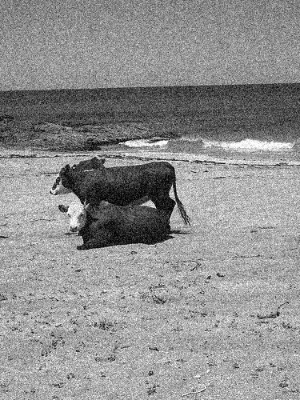
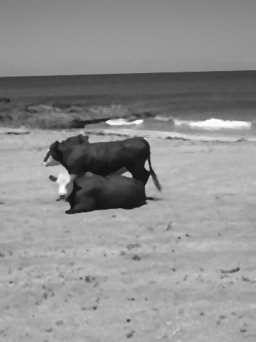

# OpenCV - histogram operations and image filtering

This repository contains a set of image processing functions written from scratch using OpenCV library. 
The first part focuses on contrast enhancement methods (histogram operations), the second on image filtering. 
The repository consists of image directories, two modules with functions, and a main file - main.py. 

## Table of contents
* [Histogram stretching](#histogram-stretching)
* [Histogram equalization](#histogra-equalization)
* [Averaging filter](#averaging-filter)
* [Gauss filter](#gauss-filter)
* [Median filter](#median-filter)

## Histogram stretching
Histogram stretching - stretching the range of values so that the histogram covers the entire range of brightness levels (from 0 to 255).

 &nbsp&nbsp 

## Histogram equalization
Histogram equalization - selecting values to make the histogram as even ("flat") as possible across the range of brightness levels.

 &nbsp&nbsp 

Histogram before and after equalization:

 &nbsp&nbsp 

## Averaging filter
Image in grey scale and images smoothed with an averaging mask of 3x3 pixels and 5x5 pixels. Mask determines the area of averaging of image pixel values and the mask coefficients are equal to 1.

 &nbsp  &nbsp 

## Gauss filter
In the Gauss filter, the mask coefficients are calculated from the normal distribution equation. This filter, like the averaging filter, can be used to de-noise an image.

 &nbsp&nbsp 

## Median filter
The median is a nonlinear function that can be defined as the middle value from an ordered ascending sequence of pixel values from the entire considered pixel neighborhood.
This filter can be used to remove "salt and pepper" type noise.

 &nbsp&nbsp 

